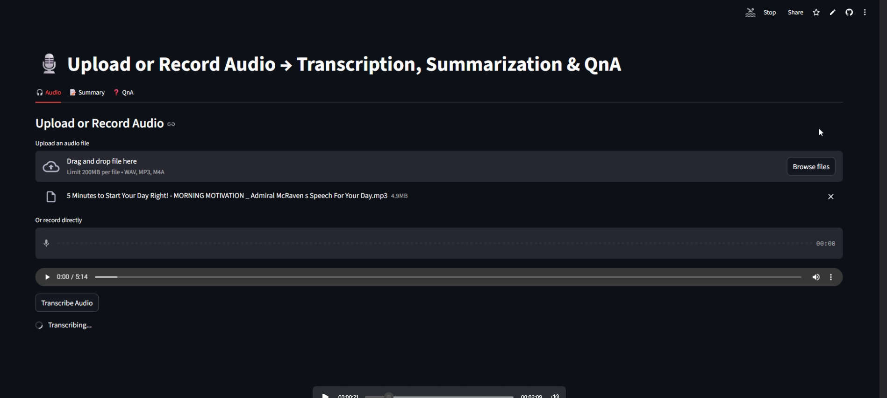
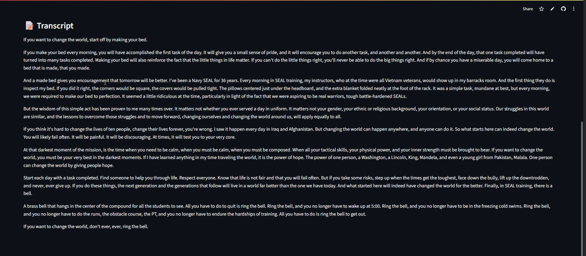
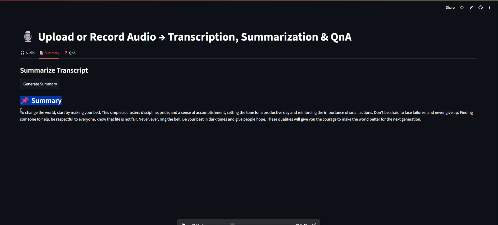
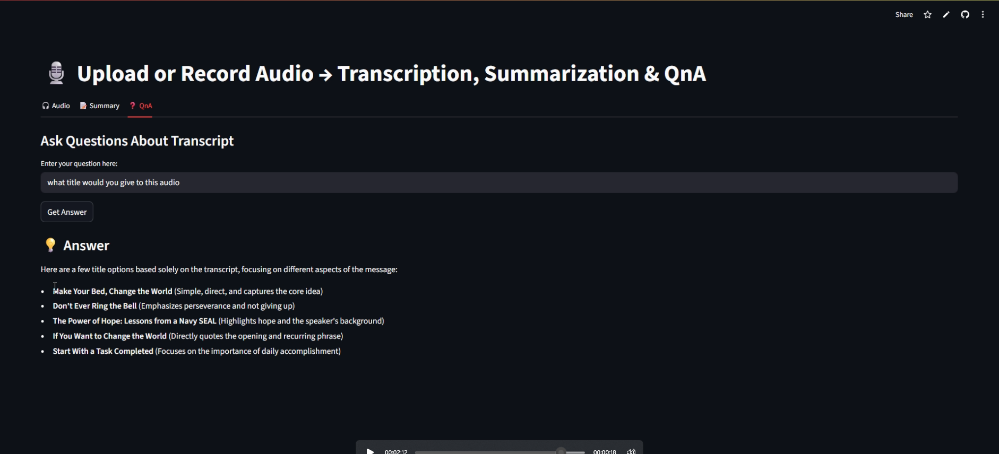

# 🎤 Vocal - AI-Powered Audio Assistant

Check out [Vocal for Transcripting,Summarization,Question and Answering](https://vocal-trancript-sum-qna.streamlit.app)) .

**Vocal** is an AI-powered application that allows you to **transcribe audio**, **summarize content**, and **ask questions** about your audio files. Built with **ChatGPT and Gemini API**, it brings the power of advanced AI to your fingertips.  

---

## 🚀 Features

- **🎧 Audio Transcription:** Convert audio files into text with high accuracy.  
- **📝 Summarization:** Generate concise and detailed summaries from long audio transcripts.  
- **❓ Question & Answer (QnA):** Ask questions about your audio content and get instant AI answers.  
- **⚡ Powered by Gemini API:** Uses the latest **Gemini API** for advanced NLP capabilities.  
- **📂 File Uploads:** Upload MP3, WAV, or other audio files directly to get started.  

---

## 🛠 Tech Stack

| Layer                  | Technology |
|------------------------|------------|
| **Frontend**           | Streamlit |
| ** NLP**               | OpenAI ChatGPT + Gemini API |
| **Audio Processing**   | PyMuPDF / pdfplumber / Pydub |
| **Hosting**            | Streamlit Cloud |

---

## 💻 How It Works

1. **Upload Audio File**  
   Upload your audio file (MP3/WAV) through the app.  

2. **Transcription**  
   The app uses **Gemini API** to convert audio into text.  

3. **Summarization**  
   The transcribed text can be summarized into concise content or detailed summaries.  

4. **QnA**  
   Ask questions about your audio content using natural language and get AI-powered answers instantly.  

---

## 📸 Screenshots / GIFs

**Uploading Audio:**  

 

**Transcription in Action:**  

  

**Summarization**  

**QNA** 
**Summarization** 

---
# Run the app
streamlit run app.py
